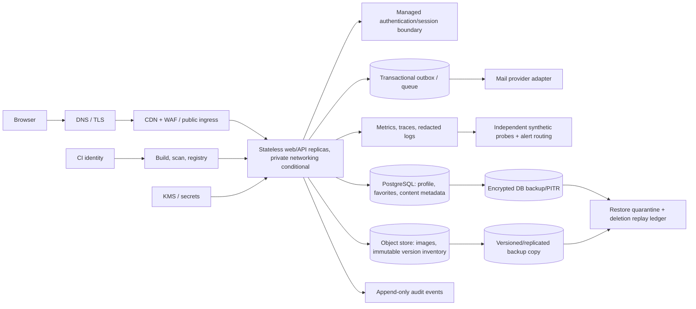

Current D5 authority: README.md and d5-desk-change-disposition.csv. Provider adapters, global admission, API journey/sampling, timing, broker, ledger replay, staffing/migration and complete quote files govern all superseded generic proposals below. Formal original source facts govern all conditional choices. No author score or verified outcome.

# D4 design authority

Current detailed decisions: adoption-decisions.md and trust-boundaries.md. Numeric configuration and controls: operational-envelope.md. IAM: iam-design.md and iam-action-matrix.csv. Scenario-level recovery: scenario-recovery-D5.csv. Cost quantities and current comparison: cost-configuration-D5.md and conditional-bill-of-quantities.csv. These D4 files govern any earlier generic discussion below. Formal business answers govern every conditional proposal.
No managed service is assumed to expose user-controlled zone placement. Two-zone app topology below is logical intent pending each runtime's actual placement/failure behavior. All owner names, approved automation and measured outcomes remain absent. Fixed formal constraints are preserved; new questions concern only residual decisions.

# Conditional three-provider architecture options

Private desk proposal, no provider selected, not tested, not an attestation of domestic residency/compliance/SLO. Requirement ledger is the traceability index. Common workload assumptions are identical for all options: Japan users; start registration 10k, later 1M over about 3 years; 1M PV/month; dynamic nominal 10 RPS, 100 RPS for 15 minutes, 500 concurrent clients and 9:1 read/write. These are independent constraints, not mathematically reconciled. 1,000 RPS is a separate 15-minute 10× sensitivity, not sustained capacity. Normal traffic duty duration/frequency, MAU/DAU, content-size mix, growth traffic mapping, email provider, Japan-only scope and domain remain UNANSWERED.

## Shared logical design and data flows

- Request flow: TLS at provider edge/load balancer; WAF rate/bot rules; web/API in private networking; server-side authz checks; SQL for users/profile/favorites/content metadata; signed/authorized object reads for images. Image ingestion only by a dedicated admin role after format/size/content checks and approval; regular API role cannot write objects. Admin path is conditional because its human authorization process is unresolved.
- Email: business transaction writes an outbox record atomically; worker sends through provider adapter with idempotency key and bounded retry/backoff/dead-letter and operator alert. Delivery completion is outside primary API latency SLI; delivery lag/failure is separately observed. Mail vendor, recipient-side retention, region, and duplicate semantics are UNANSWERED; provider must not be assumed Japan-only.
- Telemetry: privacy-filtered request IDs, service metrics and traces; no names, email, tokens, credentials, auth payloads or signed URLs in routine logs. Audit events have distinct restricted access/retention. Their allowed locations/retention remain UNANSWERED. Probe endpoints exercise login/list/detail/profile/favorites via synthetic non-personal data and measure from an external Japan vantage; probe identity/secret location must be reviewed.
- Backup/deletion: data-class inventory for SQL, objects and versions, auth/session, outbox/mail, logs/audit, backups/replicas, keys and caches. Offboarding creates durable deletion case and per-copy work items; deletion clock and allowed ledger data are UNANSWERED. Lifecycle expiration is not proof of deletion. Track current/noncurrent versions, delete markers, replication lag/failure and incomplete multipart uploads separately. Restore into quarantine, replay deletion ledger before serving, then verify each data-class/copy and keep evidence without personal data. Backup upper age 35 days is a bound from requirements; PITR duration is UNANSWERED. Key deletion wait is a cleanup/availability dependency.
- Failure boundaries: request edge; stateless compute instance/zone; managed DB process/storage/AZ; object service/replication; identity/mail vendors; regional control plane; DNS/certificate; CI/registry; human responder. Multi-zone does not address region/provider-wide or logical corruption. Automatic failover claims require provider behavior plus app retry/connection-pool validation, not topology alone.
- CI/IaC: environment-separated modules and state with tightly scoped workload/deployment identity, secret-free plan artifacts, drift review, approval gates, immutable image digest, signed provenance where supported, staged rollout and rollback. State backend, CI provider, registry scanning, policy checks, retention and operator ownership are costed as unknown where no commitment is specified. No init/plan/apply or API access in this run.

## Conditional provider mappings

|Concern|AWS candidate (reference, not preferred)|Azure candidate|GCP candidate|
|---|---|---|---|
|Japan locations to validate|ap-northeast-1 Tokyo; Osaka as separately validated DR option|Japan East; Japan West DR option|asia-northeast 1 Tokyo; asia-northeast 2 Osaka DR option|
|Web/API|ECS on Fargate behind ALB; private tasks, at least two AZs for availability proposal|Azure Container Apps consumption/dedicated workload profile behind Front Door/Application Gateway candidate; VNet integration and zone placement to validate|Cloud Run behind regional external Application Load Balancer; VPC connector/direct egress and zone behavior to validate|
|SQL|RDS for PostgreSQL Multi-AZ; backups/PITR and cross-region copy as separate choices|Azure Database for PostgreSQL Flexible Server zone-redundant HA; geo-redundant backup is separate|Cloud SQL for PostgreSQL regional HA; PITR and cross-region replica/backup are separate|
|Objects/images|S3 with versioning; same-region backup copy and/or cross-region replication separate|Blob Storage versioning/soft delete; object replication and backup separate|Cloud Storage versioning/soft delete; dual-region or replication and backup separate|
|Queue/outbox|SQL outbox plus SQS|SQL outbox plus Service Bus Queue|SQL outbox plus Pub/Sub|
|Identity/secrets/keys|Cognito candidate; Secrets Manager + KMS|Entra External ID candidate (availability/price/region to verify); Key Vault|Identity Platform candidate; Secret Manager + Cloud KMS|
|DNS/TLS/WAF|Route 53, ACM, AWS WAF|Azure DNS, managed certificate/Key Vault certificate, Front Door WAF|Cloud DNS, Certificate Manager, Cloud Armor|
|Monitoring/audit|CloudWatch, CloudTrail; external synthetic origin still required|Azure Monitor/Log Analytics, Activity Log; external synthetic origin still required|Cloud Monitoring/Logging, Audit Logs; external synthetic origin still required|
|Registry/CI|ECR + image scanning; CI vendor unknown|ACR + Defender for Containers/scanning; CI vendor unknown|Artifact Registry scanning; CI vendor unknown|

These mappings are architecture candidates, not proof every service supports every selected feature in the named region. Verify service feature/zone availability, endpoint and control-plane geography, SLA exclusions, quotas, egress paths, and contracts before any decision. Azure identity service and all external identity/email/probe/control-plane geography are especially unresolved. Do not use global DNS/CDN/identity control-plane labels to infer data residency.

## Resilience and change conditions

- Default candidate for availability discussion: two-zone compute + provider managed zone-resilient SQL. This is not automatically compatible with ¥100k/month. A single-zone/single-instance budget optimization would violate the assumed availability strategy until accepted explicitly.
- In-region zone failure: route/probe detection, managed SQL failover, compute reschedule/scale, bounded client retries, queue buffering; establish measured recovery time and data watermark. REQ-10/11 already applies to process/runtime/DB/single-AZ failures with the formal clocks; additional external dependency recovery objectives require owner decision while dependency failures remain included in monthly SLO.
- Region loss: no promise. Options are cold rebuild from separately protected backup, warm replica/standby, or no regional copy. Compare recovery targets/data-transfer/key/DNS readiness only after owner approves data location and a separate DR objective. REQ-24 remains a decision, not a commitment.
- Logical corruption/deletion: isolate writer, stop replication of bad state where possible, choose a known-good timestamp, restore into quarantine, reconcile subsequent valid business records, replay deletion ledger, compare integrity, approve publication. Four-hour clock begins at recovery decision per formal tentative requirement; time-to-detection is separate. Acceptance of irrecoverable later writes is UNANSWERED.
- Review triggers: 1000 RPS sustained instead of 15-minute sensitivity; one million user growth with materially changed active usage; cost cap/FX change; provider feature/price/region change; identity/mail location answer; PITR requirement; staffed 24x7 response; inability to meet measured p95/error or RTO/RPO; deletion proof gap.

## Known requirement conflicts / HOLD items

Historical base requirement names Japan domestic storage, but current owner questions expand categories including auth/session, mail, logs, telemetry, backups, keys and DNS/identity/control-plane metadata. Scope is UNANSWERED; no architecture can certify location. RTO 30m and RPO 5m for process/platform/DB/single AZ has a fixed formal clock; monthly 99.9 includes dependencies and planned downtime. No exclusions are adopted. Additional dependency recovery-objective scope is open. A 100,000 yen monthly cap excludes labor/domain/paid human support in formal answers, whereas user's hardgate requires labor ownership and hours separately quantified. Prior B-3 assumed Japan two-site architecture and selected AWS-shaped products; these are not reused as preferred defaults. Historical 7-day PITR suggestion is unapproved.

## Role/action, failure dependency and portability evidence templates

No named people or coverage commitment is implied. Before deployment, assign a primary role and backup role for each row, approved hours, escalation path, vendor contact, least-privilege identity, and substitute/leave process; current state is `UNANSWERED`.

|Work boundary|Role category (planning only)|Permitted action / separation|Evidence required|Owner answer still open|
|---|---|---|---|---|
|Routine deploy|Release operator|Deploy approved immutable digest; cannot approve own production change|PR/change approval, digest, deploy and rollback timestamps|Named authority and weekday/after-hours availability|
|DB restore/failover|Platform/DB operator|Initiate restore/failover; separate business go/no-go for logical data loss|Incident record, fencing/restore watermark, integrity checks|Who approves lost-write boundary and recovery scope|
|Deletion|Privacy/data steward + platform executor|Steward authorizes valid request/exception; executor runs per-copy work|Case receipt, copy receipts, reconciliation, close timestamp|Allowed ledger metadata, legal exception, authority/retention|
|Keys/secrets|Security administrator|Dual control for key disable/delete; workload identities cannot administer keys|Key state/audit event, synthetic decrypt/deny check|Key wait, emergency recovery and separation policy|
|Incident response|Application/platform/vendor liaison|Run automation and contact vendor; no implicit 24×7 human response|Alert acknowledgment, dependency event IDs, actions/timings|Roster, hours, SLA and vendor escalation commitment|

Failure recovery follows this order where applicable: (1) independent detector confirms customer-visible failure and records UTC onset; (2) establish blast radius and whether sensitive data/credentials may be exposed; (3) stop unsafe writes/retries or quarantine affected data; (4) restore dependencies in order (DNS/network and identity/keys, then data stores, then compute/queue, then edge); (5) reconcile confirmed writes, outbox, versions and deletion cases; (6) validate externally through synthetic principal operations and five stable minutes for REQ-10; (7) preserve aggregate evidence, declare recovery only within assigned authority. This is a planning template: per-scenario prerequisites in `verification-protocol.csv` override the generic order, and additional dependency objective scope is unanswered; formal process/runtime/DB/single-AZ scope and clock are fixed.

Portability acceptance evidence before a provider decision: export schema/data in documented formats; reconcile row/object counts and checksums; export identity attributes without credentials while recording session reset/password migration behavior; preserve IaC/state and secret references without copying secret values; rehearse DNS/certificate cutover and rollback; compare dual-run/egress/temporary duplicate-storage costs; timestamp start, first valid request, final reconciliation and cleanup. A desk plan does not prove portability; provider formats, identity semantics, export completeness and duration need owner decisions and a separately authorized rehearsal.
