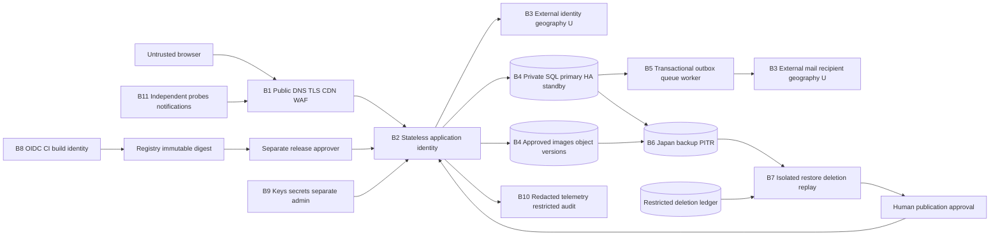

# Logical trust, data and failure boundaries

Provider-neutral conditional design. Numbered boundaries below identify scopes for the IAM matrix; neither global edge nor regional service labels prove every data/control-plane location. No provider selected.

|Boundary|Traffic/storage constraint|Failure/deletion boundary|IAM design anchor|
|---|---|---|---|
|B1↔B2|TLS, origin ingress only from approved gateway; rate/WAF changes reviewed|DNS/cert/edge failure affects principal SLO; provider edge geography U|Release/platform + ordinary user HTTPS|
|B2↔B4|Private SQL path, TLS, pool bound, per-user authz; no browser DB access|Managed primary fencing; surviving app capacity unverified; own writes read primary|API/content/deletion roles, SQL grants|
|B3↔B2/B5|Identity/mail HTTPS secrets scoped per adapter|Auth principal SLO; mail monitored outside principal latency; external copies/location U|Worker, auth deletion adapter, security roles|
|B4→B6→B7|Japan production/backups fixed; encrypted snapshots/version inventory; approved secondary Japan site only|Zone differs from region; restore quarantine cannot serve before deletion replay and loss approval|Backup/restore/deletion/key roles|
|B8→B2|Build cannot approve deploy; short-lived identity, immutable digest, private state|Registry/CI rollback unavailable may prolong recovery; no secrets in logs/plan|Build/release/approver separation|
|B9/B10/B11|Key admin separate from use; no PII/token logs; external independent probes|Key loss can defeat backup; telemetry absence never equals health; ledger retention owner-open|Key administrator/audit reader/probe|

AWS ECS/Fargate+RDS/S3/SQS, Azure Container Apps+PostgreSQL/Blob/Service Bus, GCP Cloud Run+Cloud SQL/Storage/PubSub map to this graph as alternatives. Their service placement, HA guarantees, route/egress controls and key/identity service semantics differ and need verification. A regional Cloud Run service does not provide user-specified AZ placement. Domain, external identity/mail/probe and control-plane metadata locations are unresolved.
